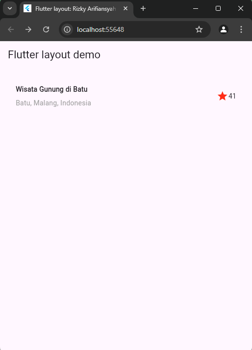
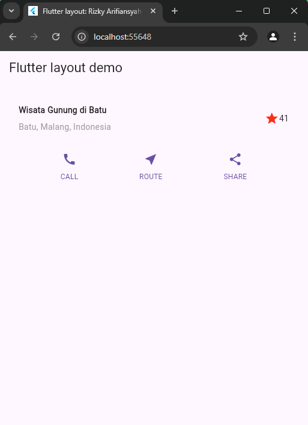
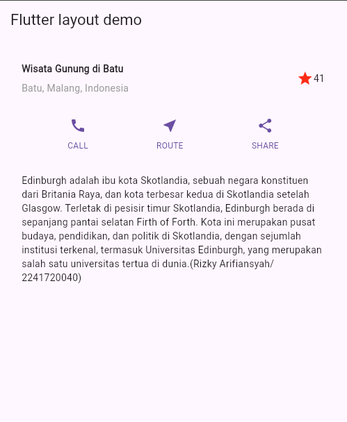
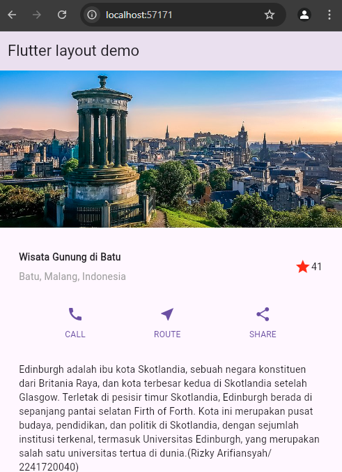

# Praktikum Week 6

## Praktikum 1: Membangun Layout di Flutter

Hasil :

## Praktikum 2: Implementasi button row

Hasil :

## Praktikum 3: Implementasi text section

Hasil :

## Praktikum 4: Implementasi image section

Hasil :

