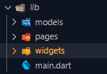
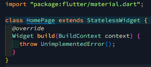
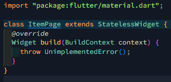
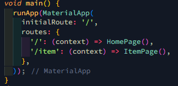
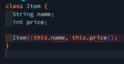
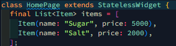
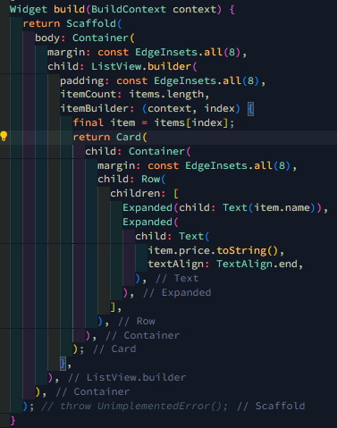
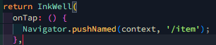
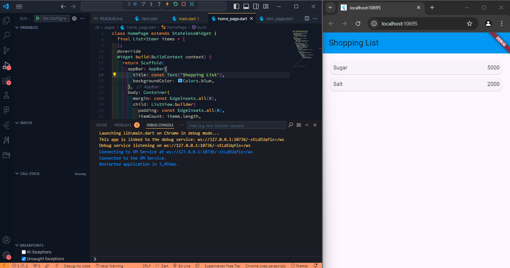

# belanja

## Langkah 1: Siapkan Project Baru

Hasil: 

## Langkah 2: Mendefinisikan route

Hasil:  HomePage:   ItemPage: 

## Langkah 3: Lengkapi Kode di main.dart

Hasil:  

## Langkah 4: Membuat data model

Hasil: 

## Langkah 5: Lengkapi kode di class HomePage

Hasil: 

## Langkah 6: Membuat ListView dan itemBuilder

Hasil: 

## Langkah 7: Menambahkan aksi pada ListView

Hasil: 

HASIL AKHIR PRAKTIKUM: 
