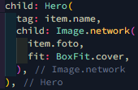

# belanja

## Langkah 1: Siapkan Project Baru

Hasil: 

## Langkah 2: Mendefinisikan route

Hasil:  HomePage:   ItemPage: 

## Langkah 3: Lengkapi Kode di main.dart

Hasil:  

## Langkah 4: Membuat data model

Hasil: 

## Langkah 5: Lengkapi kode di class HomePage

Hasil: 

## Langkah 6: Membuat ListView dan itemBuilder

Hasil: 

## Langkah 7: Menambahkan aksi pada ListView

Hasil: 

HASIL AKHIR PRAKTIKUM: 

## Tugas Praktikum 2

1. Untuk melakukan pengiriman data ke halaman berikutnya, cukup menambahkan informasi arguments pada penggunaan Navigator. Perbarui kode pada bagian Navigator menjadi seperti berikut. 
   

2. Pembacaan nilai yang dikirimkan pada halaman sebelumnya dapat dilakukan menggunakan ModalRoute. Tambahkan kode berikut pada blok fungsi build dalam halaman ItemPage. Setelah nilai didapatkan, anda dapat menggunakannya seperti penggunaan variabel pada umumnya. 
   

3. Pada hasil akhir dari aplikasi belanja yang telah anda selesaikan, tambahkan atribut foto produk, stok, dan rating. Ubahlah tampilan menjadi GridView seperti di aplikasi marketplace pada umumnya. 

4. Silakan implementasikan Hero widget pada aplikasi belanja Anda dengan mempelajari dari sumber ini: https://docs.flutter.dev/cookbook/navigation/hero-animations 

 

5. Sesuaikan dan modifikasi tampilan sehingga menjadi aplikasi yang menarik. Selain itu, pecah widget menjadi kode yang lebih kecil. Tambahkan Nama dan NIM di footer aplikasi belanja Anda. 

6. Selesaikan Praktikum 5: Navigasi dan Rute tersebut. Cobalah modifikasi menggunakan plugin go_router, lalu dokumentasikan dan push ke repository Anda berupa screenshot setiap hasil pekerjaan beserta penjelasannya di file README.md. Kumpulkan link commit repository GitHub Anda kepada dosen yang telah disepakati! 

main.dart: 

Item_Page.dart: 

Home_Page.dart: 

Hasil akhir: 

